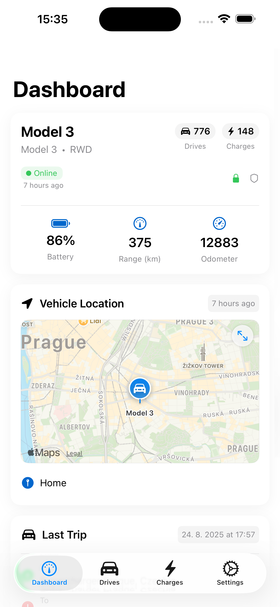
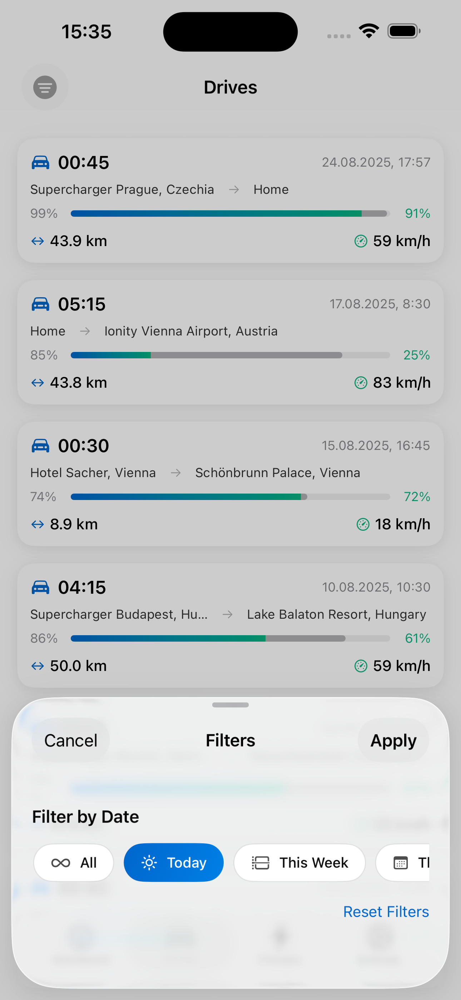

  

<h1 align="center">HedgieMate</h1>

  <strong>HedgieMate — Tesla Analytics App, compatible with TeslaMate</strong>

  
  
  
  

  
  

---

## About

HedgieMate is the most advanced native iOS Tesla analytics app, compatible with [TeslaMate](https://docs.teslamate.org/). Skip the Grafana dashboards — access your data directly from your pocket with a smooth, privacy-first design.

**Your data stays on your server.** HedgieMate connects directly to your TeslaMate instance - no cloud, no tracking, no data collection. No subscriptions, no compromises.

---

## Screenshots

  
  
  
  

---

## Features

### Dashboard
Real-time overview of your Tesla's status, battery level, range, and location.

### Statistics & Charts
Comprehensive driving statistics, efficiency metrics, and beautiful visualizations.

### Charging Sessions
Detailed charging history with cost tracking, energy consumed, and charging speed.

### Drives & Trips
Track every drive with route visualization, consumption analysis, and trip grouping.

### Multi-Platform
Native apps for iPhone, iPad, Apple Watch, Mac, and Vision Pro - one purchase works everywhere.

### Home Screen Widgets
Glance at battery, range, and location right from your home screen.

### Battery Health
Monitor battery degradation and track capacity changes over your ownership.

### Timeline View
Track parking history and analyze vampire drain patterns over time.

---

## Requirements

- **iOS 18.0** or later (iPhone, iPad, Mac, Vision Pro)
- **watchOS 11.0** or later (Apple Watch)
- **TeslaMate** instance with [TeslaMate API](https://github.com/tobiasehlert/teslamateapi) (v1.21.0+)
- Or [MyTeslaMate](https://www.myteslamate.com/) hosted service

---

## Getting Started

1. **Download HedgieMate** from the [App Store](https://apps.apple.com/us/app/hedgiemate-teslamate-app/id6751491642)
2. **Install TeslaMate API** on your TeslaMate server ([Installation Guide](https://github.com/tobiasehlert/teslamateapi))
3. **Configure the connection** in HedgieMate with your API URL
4. **Start exploring** your Tesla data!

For detailed setup instructions, visit our [Setup Guide](https://hedgiemate.com/setup/).

---

## Pricing

| Feature                   | Free    | Pro ($9.99 one-time) |
|---------------------------|---------|----------------------|
| All Apple platforms       | ✓       | ✓                    |
| Multiple car support      | ✓       | ✓                    |
| Vehicle data & statistics | ✓       | ✓                    |
| Charging sessions         | ✓       | ✓                    |
| Drive history             | 14 days | **Unlimited**        |
| Live charging & driving   | -       | ✓                    |
| Advanced charts           | -       | ✓                    |

**No subscriptions.** One-time purchase unlocks Pro forever on all your Apple devices.

---

## Languages

HedgieMate is available in **7 languages**:

- English
- Deutsch (German)
- Italiano (Italian)
- Türkçe (Turkish)
- 한국어 (Korean)
- 中文 (Chinese)
- Čeština (Czech)

Want to help translate? [Join us on Crowdin](https://crowdin.com/project/hedgiemate/invite?h=bff10a865074daf9d4e08ef064507e982646816) and get a free Pro license!

---

## Support

- **Documentation**: [hedgiemate.com](https://hedgiemate.com)
- **Discord Community**: [Join our Discord](https://discord.gg/h6vxuG4ZH8)
- **Email Support**: [support@hedgiemate.com](mailto:support@hedgiemate.com)
- **Bug Reports**: [GitHub Issues](https://github.com/LukStankovic/hedgiemate/issues)

---

## Privacy

HedgieMate is designed with privacy at its core:

- **No data collection** - We don't track, store, or analyze your data
- **Direct connection** - Your device connects directly to your TeslaMate server
- **No cloud** - All data stays between you and your server
- **No account required** - Just enter your API URL and go

Read our full [Privacy Policy](PRIVACY.md).

---

## Links

- [Website](https://hedgiemate.com)
- [App Store](https://apps.apple.com/us/app/hedgiemate-teslamate-app/id6751491642)
- [TeslaMate Documentation](https://docs.teslamate.org/)
- [TeslaMate API](https://github.com/tobiasehlert/teslamateapi)
- [Changelog](CHANGELOG.md)

---

> **Disclaimer:** HedgieMate is an unofficial community tool and is not affiliated with, endorsed by, or supported by the official TeslaMate project.
